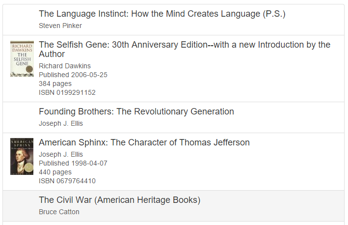
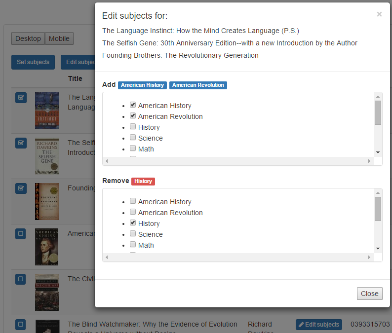

# 翻译说明（补充说明：文章价值不高不再翻译；教训：应该通篇阅读文章，然后再决定是否翻译）
> [原文链接](https://medium.com/@adamrackis/finding-state-s-place-with-react-and-redux-e9a586630172)
>
> 作者：Adam Rackis
>
> 译者：monkey	334080374@qq.com
>
> 转载请注明出处
><!--如何沟通？I'm a volunteered translator from China. Your post [Finding `state`’s place with React and Redux](https://medium.com/@adamrackis/finding-state-s-place-with-react-and-redux-e9a586630172) was pretty awesome. I'd like to translate it into Chinese and publish the translation on the biggest Chinese knowledge sharing website named Zhihu, with no profits.
>
>It's appreciated if I could luckily get your >authorization.-->
>
# 在React和Redux中准确确定state的位置
React/Redux技术相对来说还比较新。相关书籍正在出版，最佳实践经验很难获取到。React的文档和Redux的文档都很出色，尤其是Redux的文档，但是在实际使用构建项目的过程中，我却碰到了多个实践问题（个人理解，就是坑，官方文档不能解决大问题），不得不通过自己的方式去解决。

这篇博客讨论了我所理解的，在React/Redux应用中如何合理的使用“state”。我写下这篇博客，希望有更多使用React/Redux工具经验的人能够在评论中给出更合理的使用方法，并给出我这样做不合理的原因；或者给出我这样做合理的原因。
## 项目
本博客所展示的所有的代码和截图都来自我的“booklist”相关的项目。该项目就是一个web应用，其创意是你可以在这个应用中扫描书籍并从亚马逊上获取相关信息，查看他们，并将其分类等。对于我而言，这是一个有趣的项目。而做这个项目的唯一目的就是利用我的空闲时间学习日新月异的各种新技术。 Expect styling and completeness to be rough around the edges, to say the least.（最后一句不太理解）

## 用例
书籍列在设备优化的用户界面中。移动端以无序列表形式展现书籍列表，初始页面展示少量的信息，但点击后展开信息详情。桌面版UI用一个完整的表来展现书籍列表，且与书籍相关的主题可以一次修改一个，或者通过多选功能批量修改。这两者的实现都需借助state属性来实现。

一个更加熟练响应式设计的从业者能否把以上移动端和桌面端的UI工作及时完成，这还是个问题，我会多出一天来做相关工作。

## 使用状态（state）来扩展简单的UI
移动端/平板电脑端（粗略的样式处理）UI看起来如下：



点击选项展开信息详情并展示封面。为每一个书籍项维持一个“expanded”属性，随着redux action被调用，就这样更新后的书籍项传回信息并修改“expanded”属性，这样看起来过于复杂和笨重。“state”属性看起来更加的适合自然，而且代码运行并没有问题。
```
class BookViewListMobileItem extends React.Component{
    constructor(){
        super();
        this.state = { expanded: false };
    }
    toggle(){
        this.setState({ expanded: !this.state.expanded });
    }
    render(){
        return (
            <a onClick={() => this.toggle()} className="list-group-item" style={{ cursor: 'pointer' }}>
                <div className="row">
                    <div className="col-xs-3 col-sm-1">
                        {this.state.expanded ?  : null}
                    </div>
                    <div className="col-xs-9 col-sm-11">
                        <h4 className="list-group-item-heading">{this.props.title}</h4>
                        <p className="list-group-item-text">{this.props.author || 'no author'}</p>
                        { !this.state.expanded ? null :
                            <div>
                                {this.props.publicationDate ? <p className="list-group-item-text">{'Published ' + this.props.publicationDate}</p> : null}
                                {this.props.pages ? <p className="list-group-item-text">{this.props.pages + ' pages'}</p> : null}
                                {this.props.isbn ? <p className="list-group-item-text">{'ISBN ' + this.props.isbn}</p> : null}
                            </div>
                        }
                    </div>
                </div>
            </a>
        );
    }
}
```
像这样的小UI改变，如下：
```
toggle(){
	this.setState({expanded: !this.state.expanded})
}
```
看起来似乎比redux的分发函数（dispatch）更加的合适自然。
## 打开以一个桌面模态对话框
桌面书籍列表展现中可以勾选，多选，这样会使用redux的分发函数分发action并更新相关书籍项列表的“selected”属性。有一个或多个书籍被选中时，就会打开一个模态对话框类设置对应的书籍的信息。每一个书籍项还有一个可编辑信息按钮用来编辑书籍信息（subjects）。

大致的UI如下图：



我知道，处理这样的UI逻辑需要使用到Redux的知识点如下：
* store中的每一个信息项（subject）都要支持 `selectedForModalAdd` 和 `selectedForModalRemove`属性。
* flux store需要添加一个 `editTheseBooksSubjects` 数组，以及一个控制模态对话框是否显示的属性。
*
